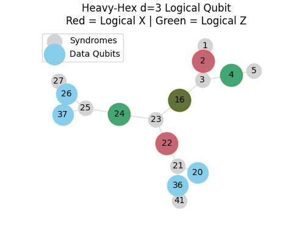
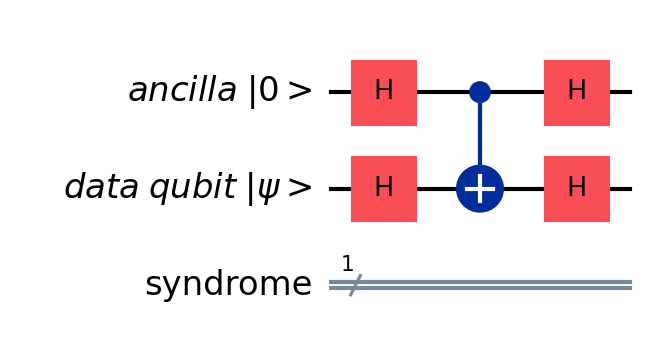
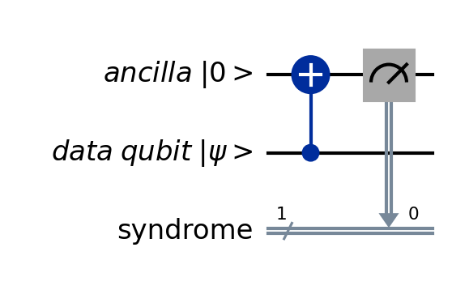

# Quantum Error Correction for SuperConducting Qubits
## General Information
This repo is intended to simulate QEC codes for IBM heavy-hex qubits. 

## Technical Details 
Import the following packages:

```
conda create --name qecenv python=3.11 # qiskit_aer does not work with newer python versions
conda activate qecenv
conda install pip

pip install stim # to simulate circuits using surface code using Google Quantum AI library, for high speed simulation of error correction
pip install pymatching # this will import numpy, matplotlib, scipy; used to decode the error
pip install qiskit
pip install qiskit_aer
pip install qiskit_experiments
pip install pylatexenc # to visualize circuits
pip install pandas
pip install seaborn
```

## Datasets
The CSV files dowloaded from IBM contain these error information per qubit:

$T_1$ (Decoherence): The time it takes for a qubit to relax from $\lvert 1 \rangle$ to $\lvert 0 \rangle$

$T_2$ (Dephasing): The time it takes for the qubit to lose its quantum phase.

Readout Error: The probability that a $\lvert 0 \rangle$ is measured as a $\lvert 1 \rangle$ (or vice versa).

Gate Errors: The specific error rate for operations like sx, x, and cx.

## Stabilizers:
First step in applying stabilizer in QEC code is to define the right patch with a desired distance. IBM heron heavy-hex machines are Heron class featuring 156 qubits.

To select the proper number of qubits and maitain their connectivity:

```
python test/heavyhex_lattice.py X
```

Where `X` is the central qubit in the patch. In `test/heavyhex_lattice.py` the patch distance is `d=3`, thus there are 17 qubits in total: $tot_{qubits} = 2d^2-1=17$, with $data_{qubit}=d^2=9$ and $ancilla_{qubit}=d^2-1=8$. In an ideal patch X and Z stabilizers (ancillas that measure Z and X errors are the same).

The code above produces this plot:



Stabilizers role are to find qubit flips' errors via certain qubits called Syndrome or Ancillas. Based on the type of the errors two separate stabilizers are designed

### X_Stabilizers:
Their roles is to identify the $\textbf{Phase-Flip}$ errors, the kind of errors that occurs due to Z-Pauli operation on a qubit. To identify this error, X-Syndromes are used. The steps to identify the phase-flip error on quantum circuits:

- Reset data/ancilla qubits' state to $\lvert 0 \rangle$
- Change qubit basis to X-Pauli basis by applying Hadamart gate; from $\lvert 0 \rangle \Rightarrow \lvert + \rangle$
- Apply Z (Phase-Flip) error to data qubits
- Apply CNOT gate by setting ancillas as control and data as target qubit: CNOT(A,D). This will cause the $\textbf{Phase Kickback}$ effect.
- Apply Hadamart gate to ancillas to change basis to Z-basis
- Measure ancillas




### Z_Stabilizers:
Their roles is to identify the $\textbf{Bit-Flip}$ errors, the kind of errors that occurs due to X-Pauli operation on a data qubit. To identify this error, Z-Syndromes are used. The steps to identify the bit-flip error on quantum circuits:

- Reset data/ancilla qubits' state to $\lvert 0 \rangle$
- Apply X (Bit-Flip) error to data qubit
- Apply CNOT gate by setting data as control and ancillas as target qubit: CNOT(D,A)
- Measure ancillas




### Running python script:
To run the X and Z stabilizer:

```python test/stabilizer.py X Y Z```

Where `X` is the central qubit of the selected patch, `Y` is the data qubit next to the Z-syndrome, and `Z` is the data qubit adjacent to the X-syndrome. After running the above code the syndrome outcome will be shown as follow:

```
python test/stabilizer.py 23 4 16

X_stabilizer (Should show flips in bits next to X-Syndrome qubits):
Syndrome Outcomes: {'00010100': 1024}
Z_stabilizer (Should show flip in bit for Qubit 4 error):
Syndrome Outcomes: {'00000010': 1024}
```