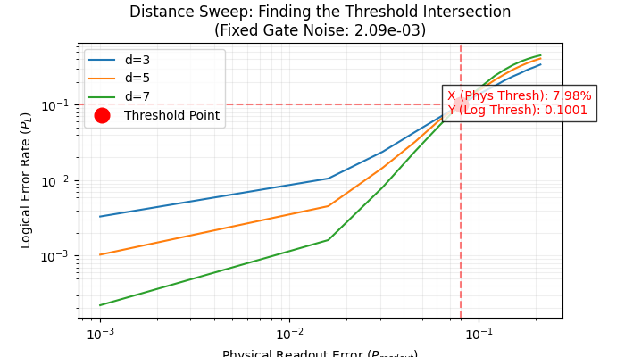

# Quantum Error Correction (QEC) Study
## Purpose
Quantum computers are significantly more susceptible to noise than classical computers due to short qubit coherence times and imperfect gate operations. This repository contains implementations designed to study and benchmark Quantum Error Correction algorithms, specifically targeting IBM’s superconducting architectures, using calibration data and noise profiles from IBM Quantum's online backends. For more details about this study please read [these slides](QEC_IBM.pdf) .

## Technical Stack
This project uses a mix of:

- Simulation: Stim (High-speed Clifford circuit simulation)
- Decoding: PyMatching (Minimum Weight Perfect Matching decoder)
- Hardware Interface: Qiskit (Accessing IBM Quantum backend properties)

## Clone & Setting Environment
To clone this repository to your area:

```
git clone https://github.com/snabili/QEC.git
```

To setup the proper environment create a conda environment:

```
conda create --name qecenv python=3.10 # qiskit_aer does not work with newer python versions
conda activate qecenv
conda install pip
```

Import the following packages:

```
pip install stim # to simulate circuits using Google Quantum AI library, for high speed simulation of error correction
pip install pymatching # this will import numpy, matplotlib, scipy; used to decode the error
pip install qiskit
pip install qiskit_aer
pip install qiskit_experiments
pip install pylatexenc # to visualize circuits
pip install pandas
pip install seaborn
```

The above packages are added to qec_env.yml, to skip the above commands and to buid the environment in one run:

```
conda env create -f qec_env.yml
```

This is a first time setup and for later use run the following command to set the environment every time you want to run the code:

```
conda activate qecenv
```

## Datasets
To access the IBM calibrated dataset:
- Open an account from [ibm_webpage](https://cloud.ibm.com/login)
- Download the api key

The calibration datasets are categorized in three main classes:
- Coherence times in $\mu s$ including the decoherence and dephasing times
- Gate properties in terms of average errors for single-qubit, double-qubits (entangled qubits), and gate duration in $ns$ 
- Measurement errors including the readout error 


## Code Structure:

```
├── qec --> the source codes
│   ├── __init__.py
│   ├── config.py
│   ├── data.py
│   ├── functions.py
│   └── utils.py
├── qec_env.yml
├── Readme.md
├── test
│   ├── comp_threshold.py --> to plot $P_L$ vs $P_{phys}$ to extract threshold
│   ├── heavyhex_lattice.py --> diagnozes surface code errors
│   ├── ibm_api.py --> keep it hidden
│   ├── plotting.py
│   ├── simulate_noise_model.py --> Plots errors from downloaded CSV file
│   └── stabilizer.py --> running stabilizer on surface code 
├── files
├── plots
```

## Surface Code
The gold standard of error correction code for QEC in industry (Google, IBM), because of its high fault-tolerance threshold (∼ 1%) & physical qubits space connectivity. It maps physical complex noises (e.g. leakage, decoherence) into discrete bit-flip
(X) and phase-flip (Z) errors. The elements of the surface code are: 

### Logical Qubits
Software-designed qubits grouped from many physical qubits to act as a single, reliable unit to detect and collect errors. To compute logical error for various number of qubits:
```
python test/comp_threshold.py
```
The plot produced by this code:


### Stabilizers:
Operators that represent the health condition of the system.
First step in applying stabilizer in QEC code is to define the right patch with a desired distance. IBM heron heavy-hex machines are Heron class featuring 156 qubits.

To select the proper number of qubits and maitain their connectivity:

```
python test/heavyhex_lattice.py X
```

Where `X` is the central qubit in the patch. In `test/heavyhex_lattice.py` the patch distance is `d=3`, thus there are 17 qubits in total: $tot_{qubits} = 2d^2-1=17$, with $data_{qubit}=d^2=9$ and $ancilla_{qubit}=d^2-1=8$. In an ideal patch X and Z stabilizers (ancillas that measure Z and X errors are the same).

The code above produces this plot:


Stabilizers role are to find qubit flips' errors via certain qubits called Syndrome or Ancillas. Based on the type of the errors two separate stabilizers are designed

#### X_Stabilizers:
Their roles is to identify the $\textbf{Phase-Flip}$ errors, the kind of errors that occurs due to Z-Pauli operation on a qubit. To identify this error, X-Syndromes are used. The steps to identify the phase-flip error on quantum circuits:

- Reset data/ancilla qubits' state to $\lvert 0 \rangle$
- Change qubit basis to X-Pauli basis by applying Hadamart gate; from $\lvert 0 \rangle \Rightarrow \lvert + \rangle$
- Apply Z (Phase-Flip) error to data qubits
- Apply CNOT gate by setting ancillas as control and data as target qubit: CNOT(A,D). This will cause the $\textbf{Phase Kickback}$ effect.
- Apply Hadamart gate to ancillas to change basis to Z-basis
- Measure ancillas


#### Z_Stabilizers:
Their roles is to identify the $\textbf{Bit-Flip}$ errors, the kind of errors that occurs due to X-Pauli operation on a data qubit. To identify this error, Z-Syndromes are used. The steps to identify the bit-flip error on quantum circuits:

- Reset data/ancilla qubits' state to $\lvert 0 \rangle$
- Apply X (Bit-Flip) error to data qubit
- Apply CNOT gate by setting data as control and ancillas as target qubit: CNOT(D,A)
- Measure ancillas


#### Running X and Z Stabilizers:
To run the X and Z stabilizer:

```
python test/stabilizer.py A B C
```

Where `A` is the central qubit of the selected patch, `B` is the data qubit next to the Z-syndrome, and `C` is the data qubit adjacent to the X-syndrome. After running the above code the syndrome outcome will be shown as follow:

```
python test/stabilizer.py 23 4 16

X_stabilizer (Should show flips in bits next to X-Syndrome qubits):
Syndrome Outcomes: {'00010100': 1024}
Z_stabilizer (Should show flip in bit for Qubit 4 error):
Syndrome Outcomes: {'00000010': 1024}
```


