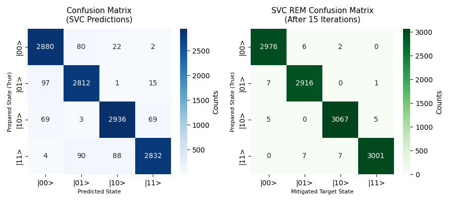

# Quantum Error Correction (QEC) Study
## Purpose
Quantum computers are significantly more susceptible to noise than classical computers due to short qubit coherence times and imperfect gate operations. This repository contains implementations designed to study and benchmark Quantum Error Correction algorithms, specifically targeting IBM’s superconducting architectures, using calibration data and noise profiles from IBM Quantum's online backends. For more details about this study please read [these slides](QEC_IBM.pdf) .

## Technical Stack
This project uses a mix of:

- Simulation: Stim (High-speed Clifford circuit simulation)
- Decoding: PyMatching (Minimum Weight Perfect Matching decoder)
- Hardware Interface: Qiskit (Accessing IBM Quantum backend properties)

## Clone & Setting Environment
To clone this repository to your area:

```
git clone https://github.com/snabili/QEC.git
```

To setup the proper environment create a conda environment:

```
conda create --name qecenv python=3.10 # qiskit_aer does not work with newer python versions
conda activate qecenv
conda install pip
```

Import the following packages:

```
pip install stim # to simulate circuits using Google Quantum AI library, for high speed simulation of error correction
pip install pymatching # this will import numpy, matplotlib, scipy; used to decode the error
pip install qiskit
pip install qiskit_aer
pip install qiskit_experiments
pip install pylatexenc # to visualize circuits
pip install pandas
pip install seaborn
pip install xgboost
```

The above packages are added to qec_env.yml, to skip the above commands and to buid the environment in one run:

```
conda env create -f qec_env.yml
```

This is a first time setup and for later use run the following command to set the environment every time you want to run the code:

```
conda activate qecenv
```

## Datasets
To access the IBM calibrated dataset:
- Open an account from [ibm_webpage](https://cloud.ibm.com/login)
- Download the api key

The calibration datasets are categorized in three main classes:
- Coherence times in $\mu s$ including the decoherence and dephasing times
- Gate properties in terms of average errors for single-qubit, double-qubits (entangled qubits), and gate duration in $ns$ 
- Measurement errors including the readout error 


## Code Structure:

```
├── qec --> the source codes
│   ├── __init__.py
│   ├── config.py
│   ├── data.py
│   ├── functions.py
│   └── utils.py
├── qec_env.yml
├── Readme.md
├── test --> running codes
│   ├── comp_threshold.py --> to plot $P_L$ vs $P_{phys}$ to extract threshold
│   ├── heavyhex_lattice.py --> diagnozes surface code errors
│   ├── IQ_helper.ipynb --> helper to study readout errors mitigation techniques on the fly
│   ├── ibm_api.py --> keep it hidden in .gitignore file
│   ├── ibu_readout.py --> applies Bayes probability and makes readout mitigation matrix plot
│   ├── iq_data.py --> extract IQ level=1 data from IBM backends
│   ├── iq_plot.py --> makes IQ states plots + ML boundaries 
│   ├── leakage.py --> computes leakage error based on pure simulation
│   ├── ml_gridsearch.py --> ML optimization
│   ├── ml_readout.py  --> train, reports fidelity of ML algos
│   ├── noise_heterogeneity.py --> compares individual heterogeneous noise w.r.t. avg noise
│   ├── plotting.py
│   ├── simulate_noise_model.py --> plots errors from downloaded CSV file
│   ├── stabilizer.py --> running stabilizer on surface code 
│   ├── xt_leakage.py --> crosstalk effect on EPC using fully simulated backend
│   └── xtalk_error.py --> crosstalk effect on EPC using online IBM backend; open-instance account have limited time usage
├── files
└── plots
```

## Surface Code
The gold standard of error correction code for QEC in industry (Google, IBM), because of its high fault-tolerance threshold (∼ 1%) & physical qubits space connectivity. It maps physical complex noises (e.g. leakage, decoherence) into discrete bit-flip
(X) and phase-flip (Z) errors. The elements of the surface code are: 

### Logical Qubits
Software-designed qubits grouped from many physical qubits to act as a single, reliable unit to detect and collect errors.

To compute the logical error for various numbers of qubits, the following simulation strategy was used:

- Worst-Case Extraction: Identify the highest physical error rates (gate and readout) from the specific IBM backend topology to set a realistic "noise floor"
- Distance Scaling: Simulated the rotated surface code across distances $d=3$, $d=5$, and $d=7$ using Stim and the PyMatching decoder
- Threshold Mapping: Perform a log-log linear interpolation to find the exact coordinates ($x, y$) where the distance curves intersect, to determine if the current hardware calibration is within the "correcting" or "failing" regime.

To run the simulation:
```
python test/comp_threshold.py
```
The plot produced by this code:


Finally to extract the desired logical error, $p_L$, using the following formula:

$$p_L = C \times (\frac{p_{phys}}{p_{thresh}})^(\frac{d+1}{2})$$

Where $C$ and $p_{thresh}$ are the vertical and horizontal coordinates of the three plots intersection in the figure above, the resulted distance values neccessary for a range of desired logical errors are:

```
logical error: 1.00e-09,  distance value = 56.86 --> d = 57 --> total number of qubits = 6497
logical error: 1.11e-06,  distance value = 34.83 --> d = 35 --> total number of qubits = 2449
logical error: 2.22e-06,  distance value = 32.65 --> d = 33 --> total number of qubits = 2177
logical error: 4.44e-06,  distance value = 30.48 --> d = 31 --> total number of qubits = 1921
logical error: 1.00e-05,  distance value = 27.93 --> d = 29 --> total number of qubits = 1681
```

### Stabilizers:
Operators that represent the health condition of the system.
First step in applying stabilizer in QEC code is to define the right patch with a desired distance. IBM heron heavy-hex machines are Heron class featuring 156 qubits.

To select the proper number of qubits and maitain their connectivity:

```
python test/heavyhex_lattice.py X
```

Where `X` is the central qubit in the patch. In `test/heavyhex_lattice.py` the patch distance is `d=3`, thus there are 17 qubits in total: $tot_{qubits} = 2d^2-1=17$, with $data_{qubit}=d^2=9$ and $ancilla_{qubit}=d^2-1=8$. In an ideal patch the number of X and Z stabilizers (ancillas that measure Z and X errors) should be the same.

The code above produces this plot:


Stabilizers role are to find qubit errors using a class of qubits called Syndrome or Ancillas. Based on the type of the errors, there are two types of stabilizers.

### X_Stabilizers:
Their roles is to identify the $\textbf{Phase-Flip}$ errors, the kind of errors that occurs due to Z-Pauli operation on a qubit. To identify this error, X-Syndromes are used. To identify the phase-flip error on quantum circuits:

- Reset data/ancilla qubits' state to $\ket{0}$
- Change qubit basis to X-Pauli basis by applying Hadamart gate; from $\ket{0} \Rightarrow \ket{+}$
- Apply Z (Phase-Flip) error to data qubits
- Apply CNOT gate by setting ancillas as control and data as target qubit: CNOT(A,D). This will cause the $\textbf{Phase Kickback}$ effect.
- Apply Hadamart gate to ancillas to change basis to Z-basis
- Measure ancillas


### Z_Stabilizers:
To identify the $\textbf{Bit-Flip}$ errors, the kind of errors that occurs due to X-Pauli operation on a data qubit. To identify this error, Z-Syndromes are used. The steps to identify the bit-flip error on quantum circuits:

- Reset data/ancilla qubits' state to $\ket{0}$
- Apply X (Bit-Flip) error to data qubit
- Apply CNOT gate by setting data as control and ancillas as target qubit: CNOT(D,A)
- Measure ancillas


### Running X and Z Stabilizers:
To run the X and Z stabilizer:
```
python test/stabilizer.py A B C
```

Where `A` is the central qubit of the selected patch, `B` is the data qubit next to the Z-syndrome, and `C` is the data qubit adjacent to the X-syndrome. After running the above code the syndrome outcome will be shown as follow:

```
python test/stabilizer.py 23 4 16

X_stabilizer (Should show flips in bits next to X-Syndrome qubits):
Syndrome Outcomes: {'00010100': 1024}
Z_stabilizer (Should show flip in bit for Qubit 4 error):
Syndrome Outcomes: {'00000010': 1024}
```
## QC Error Simulation
### Simulating Crosstalk effect:
Crosstalk arises from microwave‑pulse interference between neighboring qubits during any operation. In double-gate operation, it refers to how a two‑qubit gate applied to a target pair can unintentionally disturb the state or performance of a nearby spectator qubit.

To observe this effect cleanly, the target pair should be chosen from qubits with low intrinsic gate error, ensuring that crosstalk is not masked by unrelated noise sources.

In the simulation, the crosstalk effect is modeled as an unintended rotation $\theta$ induced on the spectator qubit. This rotation occurs because the spectator is coupled to the target pair through a tunable coupler with interaction frequency $\xi$. The induced rotation during a CZ‑gate of duration $t_{cz}$ is approximated by:

$$
\theta = 2 \times \pi \times \xi \times t_{cz} 
$$

IBM’s tunable couplers typically limit $\xi$ to $1 kHz$, which makes the real crosstalk effect extremely small. To make the effect visible in simulation, the code scales $\xi$ by a factor of 100.

Because IBM’s open‑access accounts provide limited access to real hardware backends, the crosstalk analysis is performed entirely on a simulated backend. To run the simulation, run the following code:

``` python test/xtalk_error.py ```

The effect of crosstalk with $\xi = 100 kHz$ is shown below with `Simultaneus` being the Crosstalk included effect and the `Isolated` without the effect:


### Simulating Leakage error:
Leakage occurs when a transmon qubit is excited to energy states beyond the computational subspace ($\ket{0}$ and $\ket{1}$). While the anharmonicity—provided by the nonlinear inductance (Josephson Junction) is designed to isolate the first two levels, high-speed microwave (MW) pulses can still inadvertently drive transitions to higher energy levels, such as the $\ket{2}$ state.

To analyze these effects, this simulation utilizes the following framework:

1. Gate Context: Analysis is focused on leakage induced during single-qubit gate operations.
2. Three-Level System: The transmon is modeled as a qutrit with states $\ket{0}$, $\ket{1}$, and $\ket{2}$.
3. Target Operation: The study simulates a standard X-gate (bit-flip), requiring a precise $\pi$-pulse calibration.
4. DRAG Compensation: Used Derivative Removal by Adiabatic Gate (DRAG) technique. This uses a parameter $\beta$ to scale the derivative of the Gaussian envelope, effectively canceling out-of-subspace (phase) transitions.
5. Parameter Optimization: Both the MW-pulse duration ($T$) and the DRAG coefficient ($\beta$) are swept to identify the "Leakage Floor" of the system.
6. Pulse Shaping: The drive utilizes a Gaussian envelope, where the complex component (phase shift) is determined by the $\beta$-scaled derivative.

To run the leakage estimation script, execute the following:

``` python test/leakage.py ```

The simulation generates a population plot (shown below) tracking the state evolution. The "Optimized" result minimizes the population in state $\ket{2}$ at the end of the gate duration.

 

### Noise Heterogenity
Physical transmon qubits in a superconducting backend exhibit unique noise profiles that vary significantly across the chip. This section investigates how heterogeneous noise (the unique, real-world error rates of each qubit) affects a Surface Code compared to a simplified uniform average noise model.

For this study, data from the IBM Heavy-Hex architecture (as seen on the ibm_fez backend) was used to simulate a surface code patch The setup and assumptions of the noise heterogeneity code are as follow:

1. Scalable Geometry: The code accepts a distance parameter ($d$) to define the size of the logical surface code patch
2. Syndrome Extraction: Stabilizer measurements are performed over multiple rounds using CZ-gates and ancilla measurements to detect phase and bit-flip errors.
3. Error Sources: The model incorporates specific Readout Errors and Two-Qubit Gate (CZ) errors pulled directly from the backend's daily calibration data
4. Strategic Patch Selection: The simulation identifies and selects a "Golden Patch"—the subset of physical qubits with the highest fidelity. Because the code avoids "bad apples" on the chip, the Actual Heterogeneous Error is typically lower than the Global Average Error.

To run the noise heterogeneity simulation with a distance of $3$, execute:

``` python test/noise_heterogeneity.py 3 ```

The script generates a connectivity map of the backend where qubits are color-coded based on their current calibration health (readout and gate fidelity). This visualization helps identify the optimal regions for QEC placement.


Highest error is the readout error and therefore the study of readout error and the possibility of reducing it is the main goal hereby.

# Readout Error and its mitigation (REM)
Readout error occurs when the state of a qubit is mismeasured during readout (e.g., measuring a $\ket{0}$ as a $\ket{1}$ or vice versa). In superconducting qubit architectures, this degradation is typically driven by several physical and environmental factors:

1. Short Relaxation Times: Low $T_1$ times causing state decay during the measurement pulse
2. Thermal Population: Residual thermal excitations causing population mixing
3. Instrumentation Noise: Electronic noise in the cryogenic amplification chain (e.g., TWPAs, HEMTs)
4. Suboptimal Dispersive Shifts: Insufficient dispersive coupling ($\chi$) between the readout resonator and the qubit
5. Phase/Frequency Mismatches: Numerical Controlled Oscillator (NCO) frequency mismatches with the Intermediate Frequency (IF) signal
6. Crosstalk: Signal bleeding and residual interactions between adjacent qubits
7. Leakage Overlap: Population leakage to higher-order transmon states ($\ket{2}$, $\ket{3}$) mimicking standard computational states

For a comprehensive overview of superconducting readout hardware configurations, refer to the [QEC slides](QEC_IBM.pdf)

## Characterization & Data Extraction:
To analyze how these noise channels degrade readout fidelity, raw single-shot IQ voltage data is extracted using the `StateTomography` framework from the `qiskit_experiments` library. Detailed implementations of the linear, non-linear, and statistical classification methods used for state discrimination can be found in the [IQ Analysis Notebook](IQ_helper.ipynb).

### Running the Extraction Script:
To isolate a spectator-target qubit pair (specifically Target Qubit `127` and its highest-error nearest neighbor) and extract the raw data for the four computational basis states ($\ket{00}, \ket{01}, \ket{10}, \ket{11}$), execute the following command:

`python test/iq_data.py 127`

To plot and visualize the double-qubit IQ data for double-qubit run:

`python test/iq_plot.py`
 
 

### Readout Error Mitigation via Outlier Rejection
To optimize the discriminative separation between multi-qubit single-shot $I/Q$ clusters, outlier mitigation is implemented using the Mahalanobis distance metric. This metric accounts for the directional variance and covariance of the distributed $I/Q$ voltage points, providing an effective threshold for filtering anomalous measurements.

To prevent leverage points and extreme anomalies from biasing the baseline cluster characteristics, we employ a modified approach leveraging the Minimum Covariance Determinant (MCD). The MCD algorithm provides a highly robust estimator for the location and scatter of the data, allowing the model to calculate uncorrupted Mahalanobis distances even in the presence of dense, overlapping noise in the diagonal $I/Q$ space.

Filtering these statistical outliers yields an moderate reduction in overlapping classification ambiguities, especially by improving the effective boundaries between the four joint computational states ($\ket{00}, \ket{01}, \ket{10}, \ket{11}$).

This mitigation framework demonstrates an impact on lower-performing hardware components. Specifically, the improvement is presented hereby for Qubit 127. At the baseline of this study, the raw unmitigated readout fidelities for Qubits 128 and 127 were recorded at $95\%$ and $92\%$, respectively; removing structured $I/Q$ outliers via robust distance thresholds serves as a first-line approach to mitigate the readout error and to improve the fidelity on the noisier channels.


### The Use of Machine Learning and State Discrimination
The efficacy of various supervised and unsupervised classification algorithms for multi-qubit state discrimination on the $I/Q$ voltage plane was evaluated. The benchmarked models include:
- Linear Baselines: Logistic Regression (LR) and Mahalanobis Distance Classifier (MAH)
- Non-Linear Classifiers: Support Vector Classification (SVC) with an RBF kernel and Boosted Decision Trees (BDT)
- Probabilistic Clustering: Gaussian Mixture Models (GMM).

### Data Preparation & Benchmarks
The dataset consists of single-shot $I/Q$ paired-qubit measurements prepared across the four computational basis states ($\ket{00}, \ket{01}, \ket{10}, \ket{11}$). The dataset was split into an $80/20\%$ train-test ratio using `scikit-learn`.

The resulting state-specific read-out fidelities and their corresponding ensemble means are detailed below:

```
State      | LR  Fidelity      | SVC Fidelity  | GMM Fidelity  |  MAH Fidelity    | BDT Fidelity   
----------------------------------------------------------------------------------------------------
|00>       |      0.962        |       0.965   |     0.967     |     0.964     |     0.964
|01>       |      0.958        |       0.961   |     0.958     |     0.962     |     0.959
|10>       |      0.956        |       0.954   |     0.954     |     0.954     |     0.954
|11>       |      0.944        |       0.940   |     0.940     |     0.940     |     0.942
mean:      |      0.955        |       0.955   |     0.955     |     0.955     |     0.955
```

To evaluate a specific model and generate the corresponding $I/Q$ space decision boundaries (e.g., using svc), execute:

`python test/ml_readout.py svc`

This command produces this plot:


To perform hyperparameter optimization via grid search for the non-linear models (e.g., bdt), run:

`python test/ml_gridsearch.py bdt`

### Architectural Outlook & Readout Bottlenecks

As indicated by the benchmark table, the performance discrepancy across all models is negligible ($\le 0.5\%$), with the mean fidelity converging identically at $95.5\%$. This behavioral equivalence implies that the state clusters are fundamentally linearly separable within the time-integrated $I/Q$ feature space. Consequently, introducing non-linear kernel mappings or tree-based splits yields no statistical advantage over a simple linear hyperplane.

To surpass this hardware-bound classification ceiling, two independent error mitigation paths are available:
- Time-Resolved Single-Shot Trajectories (Level-0 Data): Bypassing time-integration to analyze raw, time-dependent voltage traces. This approach allows noise filters to account for transient resonator dynamics (filling/depletion) and enables the algorithmic detection of mid-readout longitudinal relaxation ($\ket{1} \rightarrow \ket{0}$ transitions)
- Statistical Readout Error Mitigation (REM): Utilizing classical post-processing techniques to invert the stochastic assignment errors introduced during the measurement process.

Given that open-source cloud architectures abstract away time-resolved Level-0 traces, this framework implements Readout Error Mitigation via Iterative Bayesian Unfolding (IBU)

### Readout Mitigation via Iterative Bayesian Unfolding (IBU)
The IBU method minimizes assignment errors by probabilistically redistributing misclassified counts. The process begins by extracting the classical assignment probability behavior from a selected baseline classifier (e.g., svc) following hyperparameter optimization. 

To map these assignment errors using the standardized `scikit-learn`, the confusion matrix ($CM$) convention should be identified to avoid wrong result. The $CM$ rows designate the prepared target state ($T_{ij}$) and columns represent the measured/predicted state ($M_{ij}$):

$$CM = \begin{bmatrix}
    P(M_{00} \mid T_{00}) & P(M_{01} \mid T_{00}) & P(M_{10} \mid T_{00}) & P(M_{11} \mid T_{00}) \\
    P(M_{00} \mid T_{01}) & P(M_{01} \mid T_{01}) & P(M_{10} \mid T_{01}) & P(M_{11} \mid T_{01}) \\
    P(M_{00} \mid T_{10}) & P(M_{01} \mid T_{10}) & P(M_{10} \mid T_{10}) & P(M_{11} \mid T_{10}) \\
    P(M_{00} \mid T_{11}) & P(M_{01} \mid T_{11}) & P(M_{10} \mid T_{11}) & P(M_{11} \mid T_{11})
\end{bmatrix}$$

The IBU core algorithm iteratively applies Bayes' theorem to solve the inverse problem: 

Calculating the conditional probability that a system was prepared in a true state given a specific noisy measurement observation, expressed as $P(T_j \mid M_i)$.

To compute the unfolded state distributions and mitigate misidentified single-shot outcomes using a given model configuration (e.g., `svc`), run:

`python test/ibu_readout.py svc`

This execution generates the raw and mitigated comparison confusion matrices:


