# Quantum Error Correction (QEC) Study
## Purpose
Quantum computers are significantly more susceptible to noise than classical computers due to short qubit coherence times and imperfect gate operations. This repository contains implementations designed to study and benchmark Quantum Error Correction algorithms, specifically targeting IBM’s superconducting architectures, using calibration data and noise profiles from IBM Quantum's online backends. For more details about this study please read [these slides](QEC_IBM.pdf) .

## Technical Stack
This project uses a mix of:

- Simulation: Stim (High-speed Clifford circuit simulation)
- Decoding: PyMatching (Minimum Weight Perfect Matching decoder)
- Hardware Interface: Qiskit (Accessing IBM Quantum backend properties)

## Clone & Setting Environment
To clone this repository to your area:

```
git clone https://github.com/snabili/QEC.git
```

To setup the proper environment create a conda environment:

```
conda create --name qecenv python=3.10 # qiskit_aer does not work with newer python versions
conda activate qecenv
conda install pip
```

Import the following packages:

```
pip install stim # to simulate circuits using Google Quantum AI library, for high speed simulation of error correction
pip install pymatching # this will import numpy, matplotlib, scipy; used to decode the error
pip install qiskit
pip install qiskit_aer
pip install qiskit_experiments
pip install pylatexenc # to visualize circuits
pip install pandas
pip install seaborn
pip install xgboost
```

The above packages are added to qec_env.yml, to skip the above commands and to buid the environment in one run:

```
conda env create -f qec_env.yml
```

This is a first time setup and for later use run the following command to set the environment every time you want to run the code:

```
conda activate qecenv
```

## Datasets
To access the IBM calibrated dataset:
- Open an account from [ibm_webpage](https://cloud.ibm.com/login)
- Download the api key

The calibration datasets are categorized in three main classes:
- Coherence times in $\mu s$ including the decoherence and dephasing times
- Gate properties in terms of average errors for single-qubit, double-qubits (entangled qubits), and gate duration in $ns$ 
- Measurement errors including the readout error 


## Code Structure:

```
├── qec --> the source codes
│   ├── __init__.py
│   ├── config.py
│   ├── data.py
│   ├── functions.py
│   └── utils.py
├── qec_env.yml
├── Readme.md
├── test --> running codes
│   ├── comp_threshold.py --> to plot $P_L$ vs $P_{phys}$ to extract threshold
│   ├── heavyhex_lattice.py --> diagnozes surface code errors
│   ├── IQ_helper.ipynb --> helper to study readout errors mitigation techniques on the fly
│   ├── ibm_api.py --> keep it hidden in .gitignore file
│   ├── ibu_readout.py --> applies Bayes probability and makes readout mitigation matrix plot
│   ├── iq_data.py --> extract IQ level=1 data from IBM backends
│   ├── iq_plot.py --> makes IQ states plots + ML boundaries 
│   ├── leakage.py --> computes leakage error based on pure simulation
│   ├── ml_gridsearch.py --> ML optimization
│   ├── ml_readout.py  --> train, reports fidelity of ML algos
│   ├── noise_heterogeneity.py --> compares individual heterogeneous noise w.r.t. avg noise
│   ├── plotting.py
│   ├── simulate_noise_model.py --> plots errors from downloaded CSV file
│   ├── stabilizer.py --> running stabilizer on surface code 
│   ├── xt_leakage.py --> crosstalk effect on EPC using fully simulated backend
│   └── xtalk_error.py --> crosstalk effect on EPC using online IBM backend; open-instance account have limited time usage
├── files
└── plots
```

## Surface Code
The gold standard of error correction code for QEC in industry (Google, IBM), because of its high fault-tolerance threshold (∼ 1%) & physical qubits space connectivity. It maps physical complex noises (e.g. leakage, decoherence) into discrete bit-flip
(X) and phase-flip (Z) errors. The elements of the surface code are: 

### Logical Qubits
Software-designed qubits grouped from many physical qubits to act as a single, reliable unit to detect and collect errors.

To compute the logical error for various numbers of qubits, the following simulation strategy was used:

- Worst-Case Extraction: Identify the highest physical error rates (gate and readout) from the specific IBM backend topology to set a realistic "noise floor"

- Distance Scaling: Simulated the rotated surface code across distances $d=3$, $d=5$, and $d=7$ using Stim and the PyMatching decoder

- Threshold Mapping: Perform a log-log linear interpolation to find the exact coordinates ($x, y$) where the distance curves intersect, to determine if the current hardware calibration is within the "correcting" or "failing" regime.

To run the simulation:
```
python test/comp_threshold.py
```
The plot produced by this code:
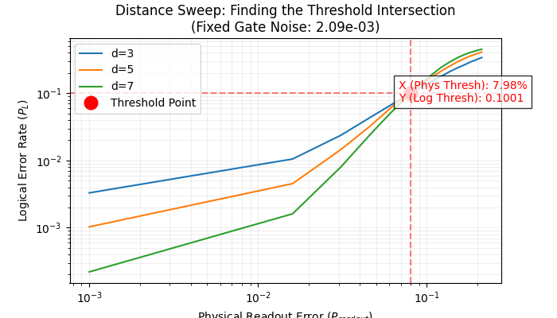

Finally to extract the desired logical error, $p_L$, using the following formula:

$$p_L = C \times (\frac{p_{phys}}{p_{thresh}})^(\frac{d+1}{2})$$

Where $C$ and $p_{thresh}$ are the vertical and horizontal coordinates of the three plots intersection in the figure above, the resulted distance values neccessary for a range of desired logical errors are:

```
logical error: 1.00e-09,  distance value = 56.86 --> d = 57 --> total number of qubits = 6497
logical error: 1.11e-06,  distance value = 34.83 --> d = 35 --> total number of qubits = 2449
logical error: 2.22e-06,  distance value = 32.65 --> d = 33 --> total number of qubits = 2177
logical error: 4.44e-06,  distance value = 30.48 --> d = 31 --> total number of qubits = 1921
logical error: 1.00e-05,  distance value = 27.93 --> d = 29 --> total number of qubits = 1681
```

### Stabilizers:
Operators that represent the health condition of the system.
First step in applying stabilizer in QEC code is to define the right patch with a desired distance. IBM heron heavy-hex machines are Heron class featuring 156 qubits.

To select the proper number of qubits and maitain their connectivity:

```
python test/heavyhex_lattice.py X
```

Where `X` is the central qubit in the patch. In `test/heavyhex_lattice.py` the patch distance is `d=3`, thus there are 17 qubits in total: $tot_{qubits} = 2d^2-1=17$, with $data_{qubit}=d^2=9$ and $ancilla_{qubit}=d^2-1=8$. In an ideal patch X and Z stabilizers (ancillas that measure Z and X errors are the same).

The code above produces this plot:

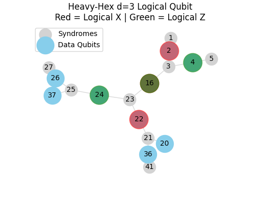

Stabilizers role are to find qubit flips' errors via certain qubits called Syndrome or Ancillas. Based on the type of the errors two separate stabilizers are designed

### X_Stabilizers:
Their roles is to identify the $\textbf{Phase-Flip}$ errors, the kind of errors that occurs due to Z-Pauli operation on a qubit. To identify this error, X-Syndromes are used. The steps to identify the phase-flip error on quantum circuits:

- Reset data/ancilla qubits' state to $\lvert 0 \rangle$
- Change qubit basis to X-Pauli basis by applying Hadamart gate; from $\lvert 0 \rangle \Rightarrow \lvert + \rangle$
- Apply Z (Phase-Flip) error to data qubits
- Apply CNOT gate by setting ancillas as control and data as target qubit: CNOT(A,D). This will cause the $\textbf{Phase Kickback}$ effect.
- Apply Hadamart gate to ancillas to change basis to Z-basis
- Measure ancillas

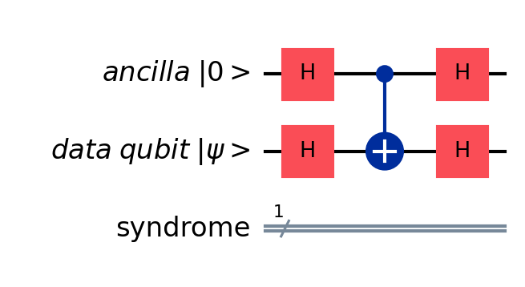


### Z_Stabilizers:
Their roles is to identify the $\textbf{Bit-Flip}$ errors, the kind of errors that occurs due to X-Pauli operation on a data qubit. To identify this error, Z-Syndromes are used. The steps to identify the bit-flip error on quantum circuits:

- Reset data/ancilla qubits' state to $\lvert 0 \rangle$
- Apply X (Bit-Flip) error to data qubit
- Apply CNOT gate by setting data as control and ancillas as target qubit: CNOT(D,A)
- Measure ancillas

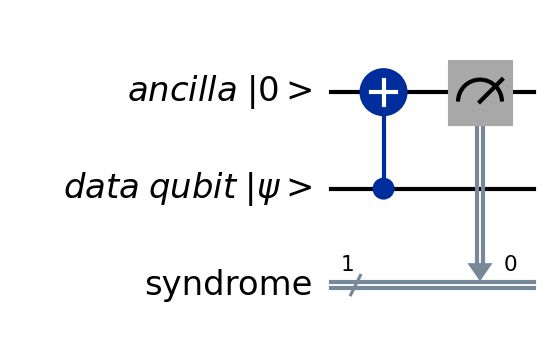

### Running X and Z Stabilizers:
To run the X and Z stabilizer:
```
python test/stabilizer.py A B C
```

Where `A` is the central qubit of the selected patch, `B` is the data qubit next to the Z-syndrome, and `C` is the data qubit adjacent to the X-syndrome. After running the above code the syndrome outcome will be shown as follow:

```
python test/stabilizer.py 23 4 16

X_stabilizer (Should show flips in bits next to X-Syndrome qubits):
Syndrome Outcomes: {'00010100': 1024}
Z_stabilizer (Should show flip in bit for Qubit 4 error):
Syndrome Outcomes: {'00000010': 1024}
```

### Simulating Crosstalk effect:
Crosstalk arises from microwave‑pulse interference between neighboring qubits during gate execution. In practice, it refers to how a two‑qubit gate applied to a target pair can unintentionally disturb the state or performance of a nearby spectator qubit.

To observe this effect cleanly, the target pair should be chosen from qubits with low intrinsic gate error, ensuring that crosstalk is not masked by unrelated noise sources.

In the simulation, the crosstalk effect is modeled as an unintended rotation $\theta$ induced on the spectator qubit. This rotation occurs because the spectator is coupled to the target pair through a tunable coupler with interaction frequency $\xi$. The induced rotation during a CZ‑gate of duration $t_{cz}$ is approximated by:

$$
\theta = 2 \times \pi \times \xi \times t_{cz} 
$$

IBM’s tunable couplers typically limit $\xi$ to around $1 kHz$, which makes the real crosstalk effect extremely small. To make the effect visible in simulation, the code scales $\xi$ by a factor of 100.

Because IBM’s open‑access accounts provide limited access to real hardware backends, the crosstalk analysis is performed entirely on a simulated backend. To run the simulation, use the following code:

``` python test/xtalk_error.py ```

The effect of crosstalk with $\xi = 100 kHz$ is shown below with Simultaneus being the Crosstalk included effect and the Isolated legend showing without the effect:

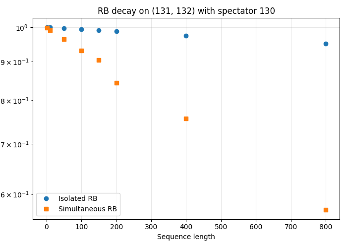

### Simulating Leakage error:
Leakage occurs when a transmon qubit is excited to energy states beyond the computational subspace ($\ket{0}$ and $\ket{1}$). While the anharmonicity—provided by the nonlinear inductance of the Josephson Junction—is designed to isolate the first two levels, high-speed microwave (MW) pulses can still inadvertently drive transitions to higher energy levels, such as the $\ket{2}$ state.

To analyze these effects, this simulation utilizes the following framework:

1. Gate Context: Analysis is focused on leakage induced during single-qubit gate operations.
2. Three-Level System: The transmon is modeled as a qutrit with states $\ket{0}$, $\ket{1}$, and $\ket{2}$.
3. Target Operation: The study simulates a standard X-gate (bit-flip), requiring a precise $\pi$-pulse calibration.
4. DRAG Compensation: Used Derivative Removal by Adiabatic Gate (DRAG) technique. This uses a parameter $\beta$ to scale the derivative of the Gaussian envelope, effectively canceling out-of-subspace (phase) transitions.
5. Parameter Optimization: Both the MW-pulse duration ($T$) and the DRAG coefficient ($\beta$) are swept to identify the "Leakage Floor" of the system.
6. Pulse Shaping: The drive utilizes a Gaussian envelope, where the complex component (phase shift) is determined by the $\beta$-scaled derivative.

To run the leakage estimation script, execute the following:

``` python test/leakage.py ```

The simulation generates a population plot (shown below) tracking the state evolution. The "Optimized" result minimizes the population in state $\ket{2}$ at the end of the gate duration.

 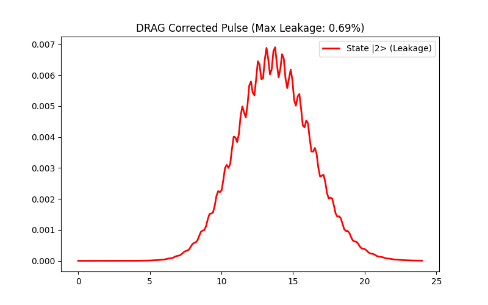

### Noise Heterogenity
Physical transmon qubits in a superconducting backend exhibit unique noise profiles that vary significantly across the chip. This section investigates how heterogeneous noise (the unique, real-world error rates of each qubit) affects a Surface Code compared to a simplified uniform average noise model.

For this study, data from the IBM Heavy-Hex architecture (as seen on the ibm_fez backend) was used to simulate a surface code patch The setup and assumptions of the noise heterogeneity code are as follow:

1. Scalable Geometry: The code accepts a distance parameter ($d$) to define the size of the logical surface code patch
2. Syndrome Extraction: Stabilizer measurements are performed over multiple rounds using CZ-gates and ancilla measurements to detect phase and bit-flip errors.
3. Error Sources: The model incorporates specific Readout Errors and Two-Qubit Gate (CZ) errors pulled directly from the backend's daily calibration data
4. Strategic Patch Selection: The simulation identifies and selects a "Golden Patch"—the subset of physical qubits with the highest fidelity. Because the code avoids "bad apples" on the chip, the Actual Heterogeneous Error is typically lower than the Global Average Error.

To run the noise heterogeneity simulation with a distance of $3$, execute:

``` python test/noise_heterogeneity.py 3 ```

The script generates a connectivity map of the backend where qubits are color-coded based on their current calibration health (readout and gate fidelity). This visualization helps identify the optimal regions for QEC placement.

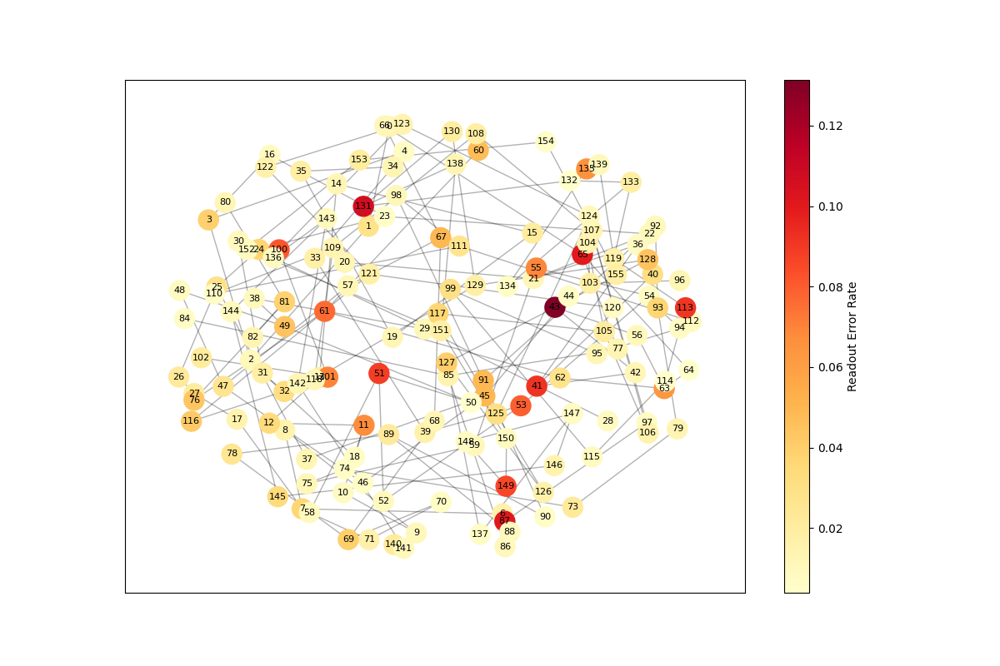

Highest error is the readout error and therefore the study of readout error and the possibility of reducing it is the main goal hereby.

## Readout Error and its mitigation
Readout error is the result of errors affecting the state of TLS qubits, such that $\ket{0}$ and $\ket{1}$ are mismeasured. The source of this error could be:

1. Short decay time or low $T_1$;
2. Hardware noises;
3. Thermal noise;
4. Dispersive shift between resonator and qubit;
5. Numerical Controller Oscillator (NCO) frequency mismatches with Intermidiate Frequency (IF);
6. Crosstalk between adjacent qubits;
7. Leakage of neighboring qubits;

For more details on how readout system works in superconducting quantum computers: [QEC slides](QEC_IBM.pdf)

To understand the effect of noises on the readout error, the raw readout voltages are extracted via the `StateTomography` class of the `qiskit_experiments` library. For more details on readout error mitigation methods used in this study see [IQ Notebook](IQ_helper.ipynb).


To run the code to extract two neighboring qubits (for qubit=`127` and neighboring qubit with highest readout error) and extract the four states ($\ket{00}, \ket{01}, \ket{10}, \ket{11}$), run this:

`python test/iq_data.py 127`

To plot and visualize the double-qubit IQ data for double-qubit run:

`python test/iq_plot.py`
 
 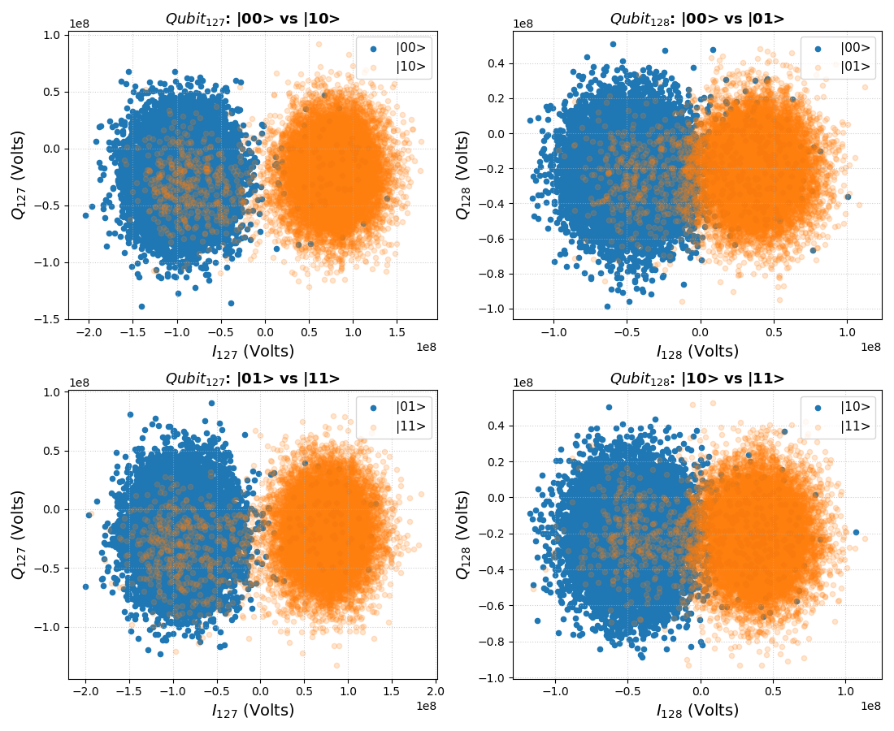

### Readout error mitigation tools
To enhance the IQ separation among double-qubits various states, the mahalanobis parameter is used primarily to remove the outliers from the IQ data points. This plot shows how using Mahalanobis distance and its modified version (MCD) that removes outliers in diagonal IQ space, improves the readout error by separating IQ data points. The plot shows the amount of improvment is more visible for qubit 127. At the time of this study, the readout fidelity for qubits 128, 127 wehre 95% and 92% respectively.

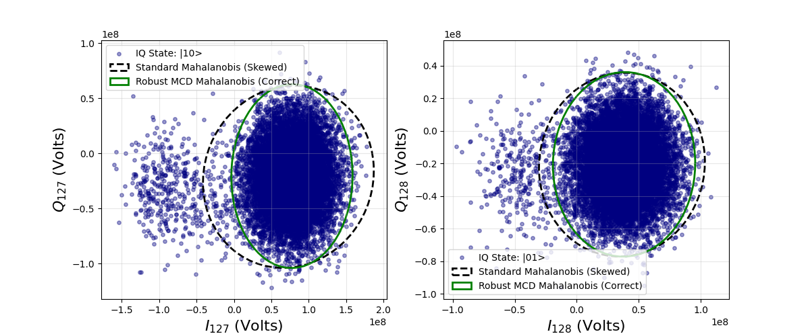

### ML on IQ Map
Used these classification ML algorithms to assess the readout error ML is able to achieve: SVC, Logistic Regression, BDT, GMM and Mahalanobis distance. 
### Data Prep:
Used double neighboring qubits I&Q data prepared in four states ($\ket{00}, \ket{01}, \ket{10}, \ket{11}$). Split train-test data by 80-20%, and used `scikit-learn` package. The resulted fidelity for individual states and the mean of states:

```
State      | LR  Fidelity      | SVC Fidelity  | GMM Fidelity  |  MAH Fidelity    | BDT Fidelity   
----------------------------------------------------------------------------------------------------
|00>       |      0.962        |       0.965   |     0.967     |     0.964     |     0.964
|01>       |      0.958        |       0.961   |     0.958     |     0.962     |     0.959
|10>       |      0.956        |       0.954   |     0.954     |     0.954     |     0.954
|11>       |      0.944        |       0.940   |     0.940     |     0.940     |     0.942
mean:      |      0.955        |       0.955   |     0.955     |     0.955     |     0.955
```

To run ML algos report as above, and make the plot of I&Q map with the ML boundaries, e.g. svc: 

`python test/ml_readout.py svc`

This command produces this plot:

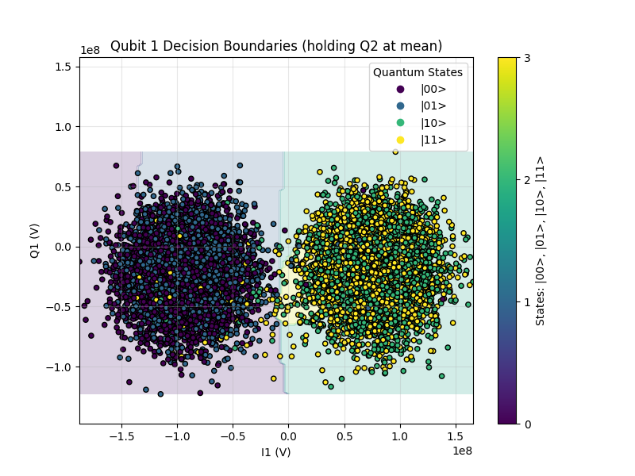

To hypertune the non-linear ML algos above, e.g., bdt, run the following command:

`python test/ml_gridsearch.py bdt`

## Path Forward
As it is shown the performance is not that different, the difference is within less than 0.5%. The reason is because the boundary between different states are kind of linear and the ML non-linear algorithms are not capable of distinguishing different states from the integrated I and Q values. 

To perform a better error mitigation study, there are two options:

1. To use the non integrated voltages and extract the raw time-dependent I and Q data, known as level-zero data, and apply noise mitigation algorithms. In addition to noise reduction (due to the resonator filling and depleting), one could detect the shots where the excited states decay back to the ground states.
2. Use Iterative-Bayesian-Unforlding (IBU) techniques to mitigate readout errors. 

In the absence of level-zero data, this study persue the error mitigation with IBU method.

### IBU Method
The Bayes method is based on reducing readout method by targetting the mis-identified states and reduce the readout error by changing the number of mis-identified counts. To begin with we take one of the ML algorithms and perform a grid search method to optimize the ML parameters and after training the data used the normalized confusion matrix (CM) from `scikit-learn`. 

The `scikit-learn` CM convention: columns represent the prediction/measured probabilities; rows are the prepared/true probabilities:

$$
CM_{\text{scikit-learn}} = \begin{bmatrix}
T00M00 & T00M01 & T00M10 & T00M11 \\
T01M00 & T01M01 & T01M10 & T01M11 \\
T10M00 & T10M01 & T10M10 & T10M11 \\
T11M00 & T11M01 & T11M10 & T11M11
\end{bmatrix}
$$

With IBU the strategy is: given the measurement $M_i$ what is the probability that the shot was originated as $T_j$: P($T_j|M_i$)

To compute the IBU reduction of the mis-identified shots for a ML algo, e.g. `svc`:

`python test/ibu_readout.py svc`

The code produces the following confusion matrix plots:

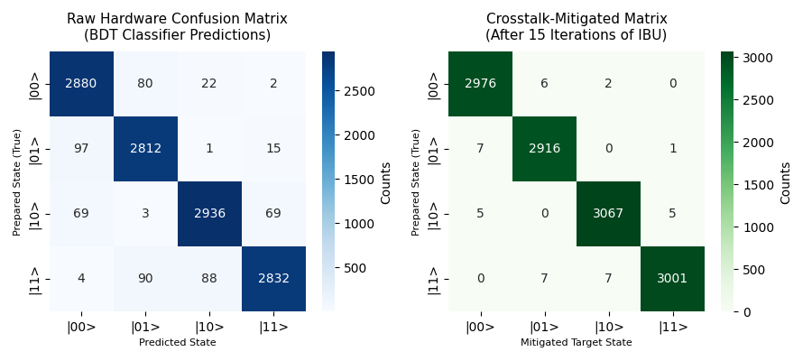
